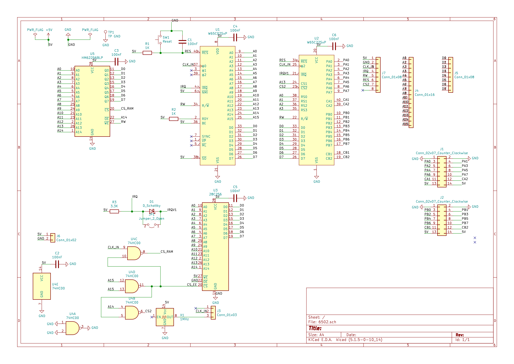
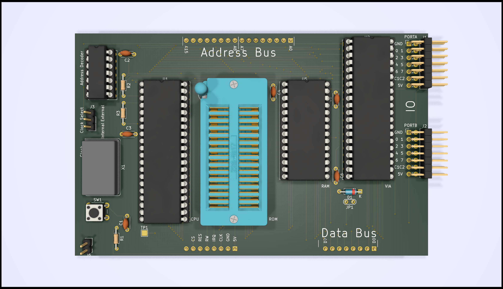

# 6502 Microcomputer

## Bill of materials

[BOM](6502.csv)

## Schematic

## PCB

### Mainboard

### Prototype Board

## Memory maps

| Type | From | To       | Comments |
|------|------|----------|----------|
| RAM  | 0x0000 | 0x3FFF |          |
| VIA  | 0x6000 |        | A14, A15 - Registers via A0 - A3 |
| ROM  | 0x8000 | 0xFFFF | A15 High |

## ROM Source Code
